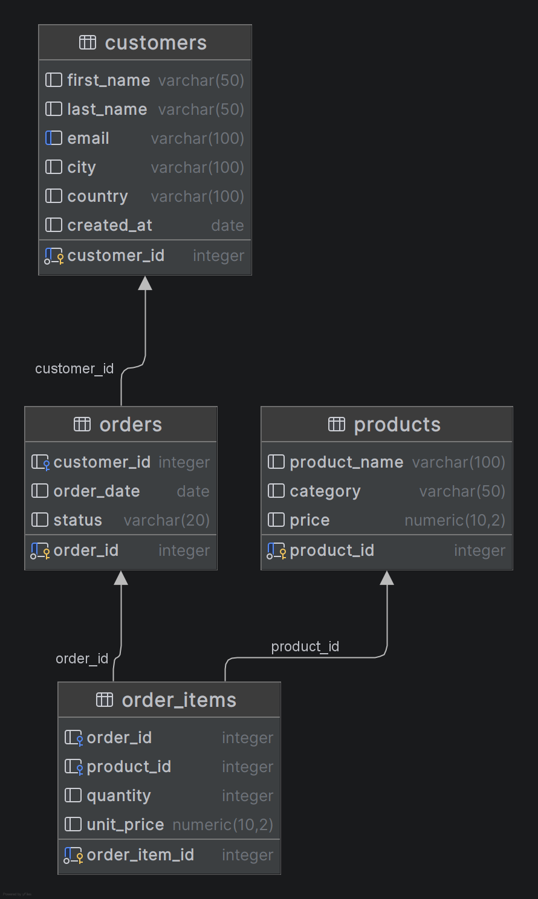

# E‑shop Sales Analytics (SQL + Python)

## Overview
This project analyzes sales, customers, and product performance using a PostgreSQL database and Python.  
The goal is to demonstrate the full workflow of designing a relational data model, running analytical SQL queries, and visualizing insights using Python.

## Database Schema (ER Diagram)

---

## Project Description
The project uses a custom e‑shop database containing customers, orders, products, and order items.  
The analysis focuses on understanding:

- which products sell the most  
- which customers generate the highest revenue  
- how order data can be transformed into meaningful business insights  

The project combines SQL (DataGrip) for data modeling and Python for visualization.

---

## Methodology

### Approach
- Design a relational schema for an e‑shop  
- Create tables and insert sample data in PostgreSQL  
- Validate and test SQL queries in DataGrip  
- Connect Python to the database using SQLAlchemy  
- Load query results into pandas  
- Create visualizations using seaborn and matplotlib  

### Tools / Technologies
- PostgreSQL  
- DataGrip (database design, SQL testing)  
- Python (pandas, seaborn, matplotlib)  
- Visual Studio Code / Jupyter Notebook  

### Data Sources
Custom PostgreSQL database containing:
- customers  
- orders  
- order_items  
- products  

---

## Results

### Key finding 1: Top‑selling products
SQL analysis shows which products have the highest total quantity sold.  
This helps identify best‑performing items.

### Key finding 2: Customer revenue
By joining orders and order items, we calculate total revenue per customer.  
This highlights the most valuable customers.

---

## Conclusions
The project demonstrates how SQL and Python can be combined to perform end‑to‑end data analysis:

- SQL handles data modeling and extraction  
- Python transforms query results into clear visual insights  
- Even a small dataset can reveal meaningful business patterns  

---

## Requirements
- Python 3.x  
- pandas  
- seaborn  
- matplotlib  
- SQLAlchemy  
- PostgreSQL  
- DataGrip or any SQL client  

---

## Author
Gabriela Dvorakova